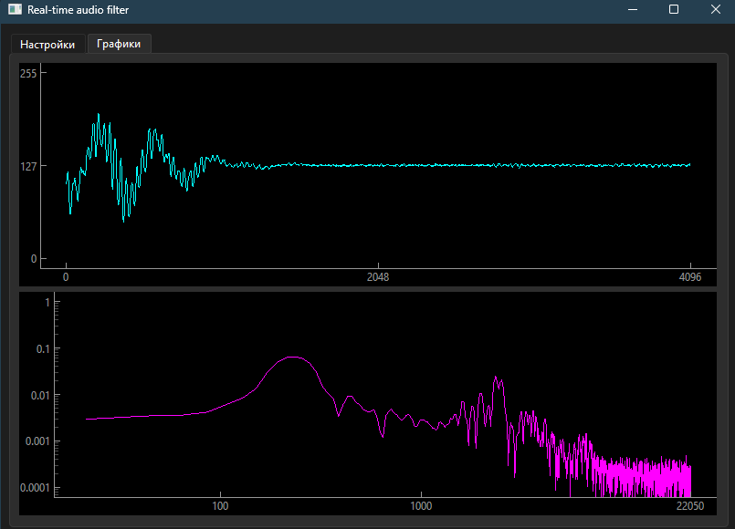
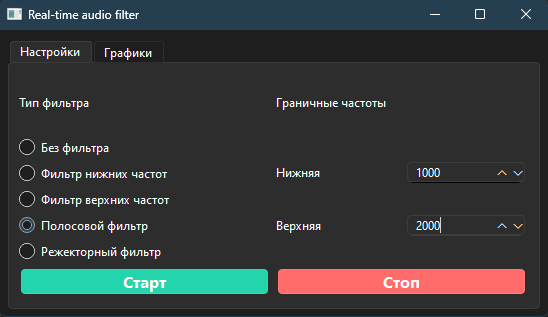

# Real time sound processing

Mini app for audio filtering in real-time using butterworth filter.

## Installation
```bash
# Clone repository
git clone https://github.com/Supercili0usMe/Real-time-sound-processing.git

# activate virtual environment
source venv/Scripts/activate

# Requirements if you don't have them or use venv
pip install -r requirements.txt

# Run
python main.py
```
## Usage
Main window looks like this:


There are 4 buttons in **settings** tab (настройки):
- **Start** (Старт) - starts the audio stream and audio processing
- **Stop** (Стоп) - stops the audio stream and audio processing
- **Without filter** (Без фильтра) - starts the audio stream and audio processing without filter
- **Low pass filter** (Фильтр нижних частот) - starts the audio stream and audio processing with low pass filter
- **High pass filter** (Фильтр верхних частот) - starts the audio stream and audio processing with high pass filter
- **Band pass filter** (Полосовой фильтр) - starts the audio stream and audio processing with band pass filter
- **Band stop filter** (Режекторный фильтр) - starts the audio stream and audio processing with band stop filter



Second tab **Graphs** (Графики) contains 2 graphs:
- **Waveform** (Волновой сигнал) - shows the waveform of input audio signal
- **Frequency spectrum** (Спектр частот) - shows the frequency spectrum of input audio signal

If you choose one of the filters, it shows cutoff frequency which you can change in **settings** tab, like this:


In that case, the lower frequency for band stop filter is 1000 Hz, and the higher frequency is 2000 Hz.

